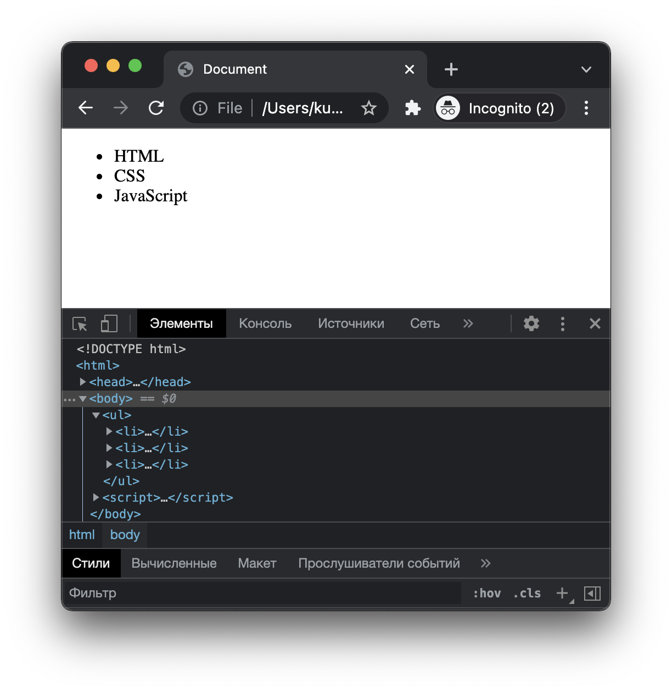

# Введение в DOM

_Начиная с данного материала ты переходишь к самой интересной части обучения – к фронтенду._

_С сегодняшнего дня такие понятия как функция, объект, массив, замыкания, асинхронность и т.д. перестают быть просто теорией. Мы начнем делать проекты, в которых результат каждой изученной темы можно будет увидеть явно – в виде работающего в браузере приложения._


## Ликбез 

Данная тема основана на стыке двух технологий: HTML и JavaScript. Самое важное, чему ты в итоге должен научиться – это манипулировать HTML-документом через JavaScript. Для этого в языке предусмотрены специальные инструменты (их называют DOM API).

Когда JavaScript выполняется в браузере (с помощью тега `<script>`), то в нём бывают доступны специальные объекты и функции. Примером такого объекта является `window` или `document`, а примеры функций – это `alert()` или `fetch()`.

Убедиться в том, что это объекты и функции доступны только в браузере не трудно.

### Эксперимент

Создай файл `index.js` и напиши в нём следующий код:

```javascript
console.log(document);
fetch('https://youtube.com');
```

Запусти код с помощью Node.js командой `node index.js`. Ты увидишь ошибку с текстом `ReferenceError: document is not defined`. 

Даже если убрать первую строку и оставить только `fetch('https://youtube.com');` Node.js всё равно выдаст ошибку, т.к. функция `fetch` ему не знакома.

Теперь создай файл `index.html` с таким содержимым:

```html
<!doctype html>
<html>
<head>
  <title>Super App</title>
</head>
<body>
  <script>
    console.log(document);
    fetch('https://youtube.com');
  </script>
</body>
</html>
```
Открой файл через браузер. Если посмотреть в консоль, то ты увидишь в ней объект `document`. На месте строки с `fetch` также нет ошибки – значит функция выполнилась успешно.

> Сейчас необязательно знать что за функция `fetch`. Главное это понять, что она доступна при выполнении JavaScript в браузере и недоступна при запуске кода через Node.js.

Объект `document` содержит в себе множество свойств и методов. Эти свойства и методы позволяют управлять текущим HTML-документом. Такое управление доступно за счет того, весь HTML-документ преобразуется в обычный JavaScript-объект. Отсюда название – **объектная** модель документа (**D**ocument **O**bject **M**odel, DOM).

#### Прочитай дополнительно 
- [Браузерное окружение, спецификации](https://learn.javascript.ru/browser-environment). Разделы про CSSOM можно пропустить.
- [DOM-дерево](https://learn.javascript.ru/dom-nodes)

## Что насчет CSS?

Если ты внимательно прочитал главу [DOM-дерево](https://learn.javascript.ru/dom-nodes), то заметил, что JavaScript позволяет управлять не только тегами, но также их CSS-свойствами.

DOM-узел HTML-элемента содержат ключ `style`. Он, в свою очередь, содержит множество других ключей, каждое из которых соответствует отдельному CSS-свойству. 

> Если название CSS-свойства содержит в себе символ тире, то соответствующий ему ключ в JavaScript будет иметь название в стиле `camelCase`.
> 
> Например, CSS-свойство `background-color` будет представлено ключом `backgroundColor`.

Простой пример замены фонового цвета страницы:

```html
<!doctype html>
<html>
<head>
  <title>Super App</title>
</head>
<body>
  <script>
    document.body.style.backgroundColor = 'red';
  </script>
</body>
</html>
```

Разберем пример по полочкам:

1) объект `document` представляет собой объектную модель страницы;
2) `document` содержит специальное свойство `body`, которое представляет собой DOM-узел тега `<body>`;
3) у всех DOM-узлов есть свойство `style` в том числе и у `document.body`;
4) в объекте `style` набор всех CSS-свойств. Изменяя это свойство в JavaScript мы меняем соответствующее CSS-свойство и на странице.

Если нужно будет поменять несколько CSS-свойств, то придется перечислять их по отдельности, например:

```javascript
document.body.style.backgroundColor = 'red';
document.body.style.color = 'white';
document.body.style.fontSize = '22px';
document.body.style.display = 'flex';
document.body.style.justifyContent = 'space-between';
```

## Получение любого DOM-узла

В предыдущем примере мы получали DOM-узел только элемента `<body>`. Он был доступен в свойстве `document.body`. Такой легкий доступ к элементу `<body>` на самом деле является исключением. То же самое касается и элемента `<head>`. Его DOM-узел доступен в `document.head`. Для всех других элементов DOM-узлы получают другим способом.

> **Примечание** 
>
> DOM-узлами могут являться не только теги, но также и другие типы элементов. Например, обычный текст или HTML-комментарий. Способ получения DOM-узла зависит от типа конкретного элемента. Далее мы будем разбирать способы получения DOM-узла тегов, т.к. этот тип операций при разработке встречается чаще всего.

### Методы для получения DOM-узлов

Для получения конкретных DOM-узлов в объекте `document` есть несколько методов:
- `document.getElementById(id)`
- `document.getElementsByTagName(tagName)`
- `document.getElementsByClassName(className)`
- `document.getElementsByName(name)`
- `document.querySelector(selector)`
- `document.querySelectorAll(selector)`

Методы `document.getElementById()` и `document.querySelector()` возвращают только один конкретный DOM-узел, а все остальные возвращают _массивоподобный объект_.

> **Что такое массивоподобный объект?**
>
> Это такие объекты, которые по своей структуре сильно похожи на массив. Например, имена ключей в таких объектах состоят только из чисел (имитация индексов массива).
> Узнать подробнее про массивоподобные объекты можно [здесь](https://a.jscourse.com/ru/article/array-like-objects) и [здесь](https://habr.com/ru/post/336136/).

#### querySelector()

Метод `document.querySelector()` является более универсальным. Он позволяет получить DOM-узел элемента по его CSS-селектору. Например:

```html
<!doctype html>
<html>
<head>
  <title>Super App</title>
</head>
<body>
  <h1>Article</h1>
  <div class="text">
    Lorem ipsum dolor sit amet, consectetur adipisicing.
  </div>
  <script>
    const title = document.querySelector('h1');
    const lorem = document.querySelector('.text');
  </script>
</body>
</html>
```

В переменной `title` теперь находится DOM-узел элемента `<h1>Article</h1>`, а в переменной `lorem` будет DOM-узел элемента `<div class="text">...</div>`. 

Теперь мы можем поменять цвет заголовка `<h1>` таким образом:

```javascript
title.style.color = 'green';
```

Кстати, давай прямо здесь чётко определимся с терминами `DOM-узел` и `HTML-элемент`, т.к. это важно для правильного усвоения материала.


Еще пример: 


То есть одна и та же сущность называется HTML-элементом в рамках HTML-кода и DOM-узлом в рамках JavaScript-кода. DOM-узел всегда представлен в виде объекта.

#### getElementById()

Данный метод позволяет получить DOM-узел если у HTML-элемента задан `id`.

```html
<!doctype html>
<html>
<head>
  <title>Super App</title>
</head>
<body>
  <button id="send-message">click me</button>
  <script>
    const button = document.getElementById('send-message');
    button.style.fontSize = '40px';
  </script>
</body>
</html>
```

#### Остальные методы

Все остальные методы возвращают не один конкретный DOM-узел, а массивоподобный объект с этими узлами. Даже если будет найден только один DOM-узел он будет представлен в массивоподобном виде с индексом `0`.

Методы `getElementsByTagName()`, `getElementsByClassName()` и `getElementsByName()` используют редко, т.к. `querySelectorAll()` заменяет функционал всех этих методов.

```html
<!doctype html>
<html>
<head>
  <title>Super App</title>
</head>
<body>
  <ul>
    <li>мафия</li>
    <li>маньяк</li>
    <li>мирный</li>
  </ul>
  <script>
    const items = document.querySelectorAll('li');
    
    // меняем цвета элементов списка
    items[0].style.color = 'red';
    items[1].style.color = 'green';
    items[2].style.color = 'blue';
    
    // следующий код не является верным - так делать нельзя!
    items.style.color = 'orange';
  </script>
</body>
</html>
```

## Изменение DOM-узла

Мы научились получать DOM-узел со страницы и менять его CSS-свойства. Часто бывает необходимо изменить характеристики DOM-узла: изменить текст внутри HTML-элемента, добавить что-то в начало или конец DOM-узла, удалить его со страницы и т.д.

Для всех этих манипуляций есть соответствующие методы. Основные описаны в учебнике JavaScript в главе [Изменение документа](https://learn.javascript.ru/modifying-document). Обязательно прочитай эту главу и возвращайся назад. Особое внимание удели пониманию методов `append()`, `prepend()`, `before()`, `after()`, `replaceWith()` и `remove()`. Они используются чаще всего и покрывают почти весь необходимый функционал для работы с DOM.

Обрати внимание, что эти методы DOM-узлов, а не объекта `document`. Хотя некоторые из них и присутствуют в `document`, однако не используются в таком контексте.

## Создание новых узлов

Последнее, что тебе осталось знать для полной модификации документа через JavaScript – это создание новых узлов и добавление их на страницу.

Создать новый узел можно с помощью метода `document.createElement()`. В качестве параметра в него передается имя тега, под который создается DOM-узел. После вызова метода будет создан новый DOM-узел, однако он не появится на странице, пока мы явно его не добавим. Также у этого узла будут отсутствовать значения по умолчанию, такие как название CSS-класса, вложенный текст и прочие атрибуты. При необходимости каждый из них добавляется с помощью соответствующих методов.

```html
<!doctype html>
<html>
<head>
  <title>Document</title>
</head>
<body>
  <div>
    Lorem, ipsum dolor sit amet.
  </div>
  <script>
    // создаем новый узел тега <h1> и сохраняем его в переменную header
    const header = document.createElement('h1');

    // на данном этапе узел уже создан, однако является "пустышкой"

    // добавляем текст в узел
    header.textContent = 'Hello world';

    // немного оформления
    header.style.color = 'red';
    header.style.fontStyle = 'italic';

    // теперь готовый узел можно добавить на страницу
    // добавим его в начало страницы, т.е. прямо перед тегом div.
    // Чтобы как-то взаимодействовать с элементом div нам нужно получить его узел тоже.
    const div = document.querySelector('div');

    // вставляем созданный узел ДО узла div
    div.before(header);
  </script>
</body>
</html>
```

В результате получаем такую страницу:


Наши возможности не ограничиваются созданием только одного узла. Можно создавать сколько угодно узлов с какой угодно вложенностью. Создадим для примера маркированный список:

```html
<!doctype html>
<html>
<head>
  <title>Document</title>
</head>
<body>
  <script>
    // создаем узел тега <ul>
    const ul = document.createElement('ul');

    // создаем три разных узла для тега <li>
    const item_1 = document.createElement('li');
    const item_2 = document.createElement('li');
    const item_3 = document.createElement('li');

    // в каждый элемент <li> добавляем текст
    item_1.textContent = 'HTML';
    item_2.textContent = 'CSS';
    item_3.textContent = 'JavaScript';

    // добавляем элементы в узел тега <ul>
    ul.append(item_1, item_2, item_3);

    // узел тега <ul> добавляем в начало тега <body>
    document.body.prepend(ul);
  </script>
</body>
</html>
```

В результате получаем такую страницу:



### Задание для закрепления

Пользуясь только возможностями DOM API сформируй страницу со следующим содержимым и дизайном:


Обрати внимание:
- блоки выравнены по центру
- ссылки находятся в один ряд
- все ссылки должны вести на соответствующие сайты
- каждая ссылка должна открываться в отдельной вкладке

### Вопросы для закрепления
- Что значит DOM? Почему эту модель называют **объектной**?
- Какие объекты и функции доступны в среде браузера, но недоступны в среде Node.js?
- Какие объекты и функции доступны в Node.js, но недоступны в браузере?
- Какие основные типы DOM-узлов ты знаешь?
